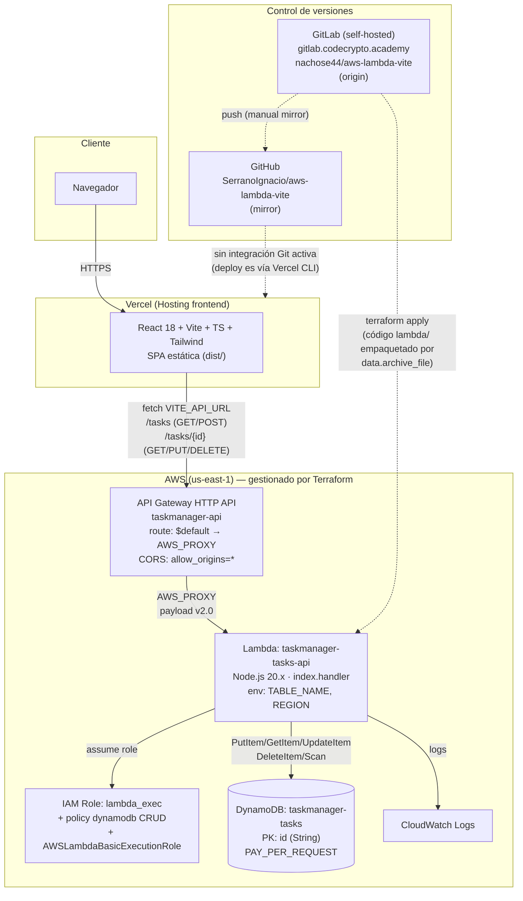

# Arquitectura

## Diagrama

## Componentes

| Componente | Recurso | Notas |
|---|---|---|
| Frontend | Vercel (proyecto `codecrypto/aws-lambda-vite`) | SPA React/Vite. Deploy manual vía `vercel --prod` (no hay integración Git activa porque el repo vive en un GitLab self-hosted, no soportado por la integración nativa de Vercel). |
| API | `aws_apigatewayv2_api.tasks` (HTTP API) | Ruta `$default` con integración `AWS_PROXY` hacia la Lambda, `payload_format_version = "2.0"`. CORS abierto (`*`) para desarrollo. |
| Backend | `aws_lambda_function.tasks_api` | Node.js 20.x, sin dependencias externas (usa el AWS SDK v3 incluido en el runtime). Router propio por `rawPath` + `requestContext.http.method`. |
| Datos | `aws_dynamodb_table.tasks` | Billing `PAY_PER_REQUEST`, partition key `id` (UUID v4). Sin índices secundarios. |
| Permisos | `aws_iam_role.lambda_exec` + `aws_iam_role_policy.lambda_dynamodb` + `AWSLambdaBasicExecutionRole` | Permisos mínimos: `PutItem`, `GetItem`, `UpdateItem`, `DeleteItem`, `Scan` sobre la tabla, más logs a CloudWatch. |
| Repos | GitLab (origin, self-hosted) + GitHub (mirror) | Se pushea a ambos remotos manualmente; no hay CI/CD configurado en ninguno todavía. |

## Por qué API Gateway y no Lambda Function URL

El `CLAUDE.md` original especifica una Lambda Function URL pública. Se implementó así y se desplegó, pero **devolvía 403 (`AccessDeniedException`) de forma consistente** pese a tener `authorization_type = "NONE"` y una resource policy correcta (`lambda:InvokeFunctionUrl`, principal `*`). Se descartaron como causa: Service Control Policies, Resource Control Policies y AWS Config con remediación automática — ninguno estaba presente en la cuenta/organización. La causa raíz no pudo aislarse. Se optó por reemplazar el Function URL por un API Gateway HTTP API con `authorization_type = NONE`, que no presenta este problema. Ver el comentario en `terraform/main.tf` y `RETROSPECTIVE.md` para el detalle de la investigación.

## URLs en vivo

- API: `https://97y80a3hu7.execute-api.us-east-1.amazonaws.com`
- Frontend: `https://aws-lambda-vite.vercel.app`
